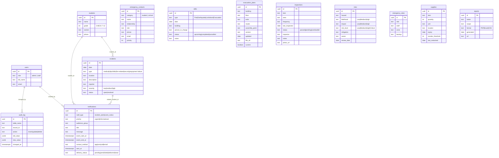

# SAAC – OSAS Dashboard

School safety & compliance system for the Office of Student Affairs and Services (OSAS) —
a role-based dashboard for managing student safety, emergency preparedness, and compliance.

> **Subsystem note:** this dashboard is a module of a larger app. The **companion app owns the login page** and hands this module a Supabase session (see [Companion integration](#companion-integration) below). This module never shows a login form.

## Tech Stack

| Layer     | Technology |
|-----------|-----------|
| Frontend  | HTML + CSS + JavaScript (vanilla, no build step) |
| Backend   | Supabase (PostgREST + Edge Functions) — no PHP, no extra host |
| Database  | Supabase (PostgreSQL) with Row Level Security |
| Auth      | Supabase Auth (provided by the companion app's login page) |
| Storage   | Supabase Storage (`evacuation-maps`, `inspection-photos`) |
| Email     | Resend (free tier, via Edge Function) |
| API       | PostgREST (RESTful JSON) |
| Version Control | Git / GitHub |
| DevOps    | Vercel (frontend) + Supabase (data/auth/functions) |

## Features

- **10 OSAS modules** — Emergency Contacts, Drill Scheduling, Evacuation Maps (file upload + versioning),
  Incident Logging, Safety Inspections (photo proof), Risk Assessment, Parent Notifications
  (incident alerts vs event notices), Compliance Reports (CSV/PDF export), Emergency Role Assignment,
  First Aid Supplies (auto low-stock flagging).
- **Role-based access** — Admin (full) vs Staff (view + log; no admin-only areas). Enforced on the
  frontend **and** via Supabase RLS.
- **Dashboard analytics** — KPI cards and two donut charts (incident type breakdown, inspection status)
  computed live from the database.
- **Cross-module automation** — incident save → "Notify parent?" (auto `incident_alert` via email/SMS/call),
  drill schedule → optional `event_notice`, supplies below threshold → auto "Low" flag.
- **Audit log** — insert/update/delete recorded for incidents, inspections, notifications, and supplies.
- **Server-side validation** via PostgREST + DB-level CHECK constraints (no separate API layer).
- **Real notifications** — the `send-notification` Edge Function delivers email via Resend (free)
  and records SMS/call for a later Twilio add-on.
- **Dev fallback** — with no real Supabase session, the UI runs on a built-in demo dataset (clearly
  labelled). The moment a session exists, every call goes to Supabase for real.

## Folder Structure

```
index.html              # app shell (sidebar, topbar)
css/osas.css            # design tokens (maroon/cream/pink) + helpers
js/
  config.js             # runtime config (Supabase keys, Edge Function URL, token slot)
  ui.js                 # shared DOM builders (tables, pills, donut charts…)
  api.js                # data layer: PostgREST + Storage first, mock fallback
  auth.js               # session resolution (injected / shared storage / dev)
  mock.js               # demo dataset used when there is no real session
  app.js                # bootstrap: shell, hash router, dashboard
  modules.js            # the 10 module pages
assets/                 # logo files
supabase/
  functions/send-notification/   # the ONLY custom backend code (Deno/TS)
backend/                        # DEPRECATED old PHP API — unused, safe to delete
  supabase/schema.sql           # tables, CHECK constraints, RLS, buckets, audit triggers
```

## Setup

### 1. Supabase

1. Create a project at [supabase.com](https://supabase.com).
2. Open the **SQL editor** and run `backend/supabase/schema.sql` — creates all tables,
   CHECK constraints, RLS policies, Realtime publication, and the two storage buckets.
3. Copy the **Project URL**, **anon key**, and **service-role key** (Settings → API)
   for the env steps below.

### 2. Run the app (dev)

It's a static site — serve the repo root with any static server:

```bash
npx serve .
# open http://localhost:3000
```

With no real Supabase session available the app runs on the **built-in demo dataset**
(marked "Running on the built-in demo dataset" in the UI). The moment a real session
exists — injected by the companion, or present in supabase-js storage — every call goes
to Supabase for real.

### 3. Demo data (optional)

The UI boots on the built-in demo dataset (`js/mock.js`) when no real session exists.
To seed real Supabase rows, either insert them via the Supabase dashboard/table editor,
or (deprecated, from the old PHP setup) `php backend/seed.php` with the service key.

### 4. Accounts & roles

Logins are owned by the **companion app**. Once a session is active, RLS enforces
roles: staff see the same modules but admin-only areas (Risk Assessment, Safety
Reports, Emergency Roles) are hidden, and staff writes to those tables return 403.

## Configuration

### Frontend (`js/config.js`)

```js
window.OSAS = {
  SUPABASE_URL: 'https://<project>.supabase.co',
  SUPABASE_ANON_KEY: '<anon key>',        // public by design
  NOTIFY_FN_URL: '',                       // Edge Function URL (see Deployment)
  accessToken: '',                         // optional — companion injection
};
```

### Supabase (Edge Function secrets)

| Variable | Purpose |
|----------|---------|
| `SUPABASE_URL` | Project URL (set automatically by Supabase Functions) |
| `SUPABASE_SERVICE_ROLE_KEY` | Service-role key — server-side only, never expose client-side |
| `SUPABASE_ANON_KEY` | Public key — validates incoming JWTs against Auth |
| `RESEND_API_KEY` | Email via Resend (free tier, 3k/mo) — needs a verified domain |
| `RESEND_FROM` | From address, e.g. `SAAC OSAS <notifications@saac.edu.ph>` |
| `SENDGRID_API_KEY` | Email via SendGrid free tier (100/day) — Single Sender Verification, no domain |
| `SENDGRID_FROM` | The verified sender address, e.g. `SAAC OSAS <saac.osas@gmail.com>` |
| `MAILEROO_API_KEY` | **Recommended — no card + no domain.** Maileroo free tier (3,000 emails/month) and they provide a free sender domain, so no domain purchase or card needed |
| `MAILEROO_FROM` | From address, e.g. `SAAC OSAS <notifications@<you>.maileroo.net>` |
| `EMAILJS_SERVICE_ID` / `EMAILJS_TEMPLATE_ID` / `EMAILJS_USER_ID` | Fallback: EmailJS free tier (200 emails/month), sends from your connected Gmail/Outlook. Template params: `to_email`, `subject`, `message` |
| `TWILIO_ACCOUNT_SID` / `TWILIO_AUTH_TOKEN` / `TWILIO_FROM_NUMBER` | Optional SMS/call (paid) — omitted = alerts recorded, no SMS sent |

Set them with: `supabase secrets set RESEND_API_KEY=re_... SUPABASE_SERVICE_ROLE_KEY=...`

## ERD



## Deployment

### Frontend — Vercel (free, no card)

1. Import the GitHub repo in Vercel.
2. No framework preset needed — it's a static site. Root directory: **`frontend`** (the repo root also contains the old PHP `backend/` etc.; this app lives in `frontend/`).
3. No env vars needed — `js/config.js` already carries the Supabase URL and anon key.
4. Deploy. Vercel auto-deploys on every push to `main`.

### Backend — Supabase (free, no card, no extra host)

1. Run `backend/supabase/schema.sql` in the Supabase SQL editor (tables, CHECK
   constraints, RLS, storage buckets, audit triggers).
2. Deploy the notification Edge Function — full steps:

   ```bash
   # a) Install the Supabase CLI (Node 18+):
   npm install -g supabase

   # b) From the frontend/ directory, init + link to your project:
   supabase init
   supabase link --project-ref rwqaeabxusivkyjgskko
   #    → signs in (create an access token at supabase.com/dashboard/account/tokens)
   #    → asks for the DB password (Settings → Database → Reset password if unknown)

   # c) Set secrets (service-role key from Settings → API; Resend key from resend.com):
   supabase secrets set SUPABASE_SERVICE_ROLE_KEY=eyJ... RESEND_API_KEY=re_...
   #    SUPABASE_URL / SUPABASE_ANON_KEY are injected automatically by the platform

   # d) Deploy:
   supabase functions deploy send-notification
   #    prints: https://rwqaeabxusivkyjgskko.functions.supabase.co/send-notification
   ```

3. Set `window.OSAS.NOTIFY_FN_URL` in `js/config.js` to the URL printed by the
   deploy command.
4. Set the sender (pick one — provider priority in the function is Resend →
   SendGrid → **Maileroo** → EmailJS):
   - **No card + no domain (recommended):** Maileroo free tier — 3,000
     emails/month and a free sender domain. Copy the sender address from the
     dashboard and set `MAILEROO_API_KEY` + `MAILEROO_FROM`.
   - **Have a domain?** Verify it in Resend (free) and set `RESEND_API_KEY` +
     `RESEND_FROM`.
   - **Other fallbacks:** SendGrid (100/day, single sender) or EmailJS
     (200/month, Gmail-connected).
5. Check it works: send a notification from the UI and look at the delivery
   status in the provider's dashboard (EmailJS activity, Resend logs, or
   SendGrid activity feed).

> The old PHP API (`backend/`) is deprecated and unused — the frontend talks to
> Supabase directly. It can be deleted once you're confident nothing references it.

## Companion integration

This dashboard is a subsystem; the login page lives in a companion app. The
companion hands this module a session one of two ways (checked in this order):

1. **Token injection** — before this module's scripts run, set the signed-in
   user's access token:
   ```html
   <script>window.OSAS = { accessToken: '<supabase-jwt>' };</script>
   <script src="/js/config.js"></script>
   ```
2. **Shared supabase-js storage** — if the companion signs in with the same
   Supabase project in the same origin, its session (localStorage
   `sb-<ref>-auth-token`) is picked up automatically.

With no session at all, the module boots in demo mode (fake data, clearly
labelled) so it stays usable before the companion is wired. RLS then enforces
roles: all authenticated users can read; admin-only tables (risks, emergency
roles, reports, supplies, plans, users) reject staff writes with 403.

> **Companion's login emails:** Supabase Auth's built-in email sender (free) is
> rate-limited (~2/hr) and only sends auth emails. For real confirmation /
> password-reset emails with the school domain, configure **Supabase Auth →
> SMTP settings** with the same verified domain used for Resend. (App emails —
> parent notifications — always go through the Edge Function + Resend.)
